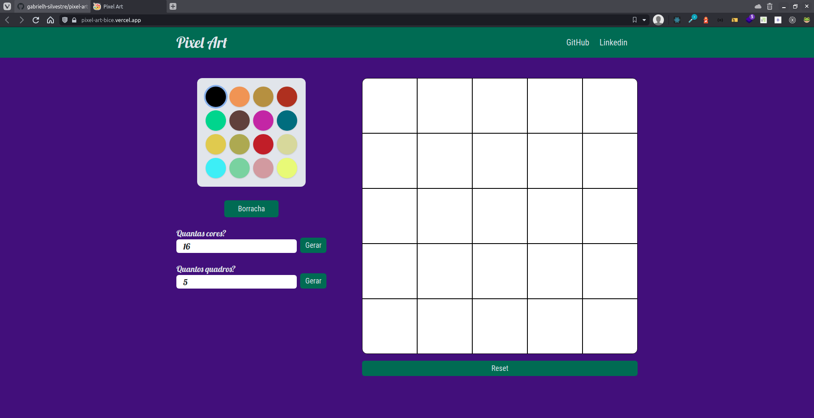
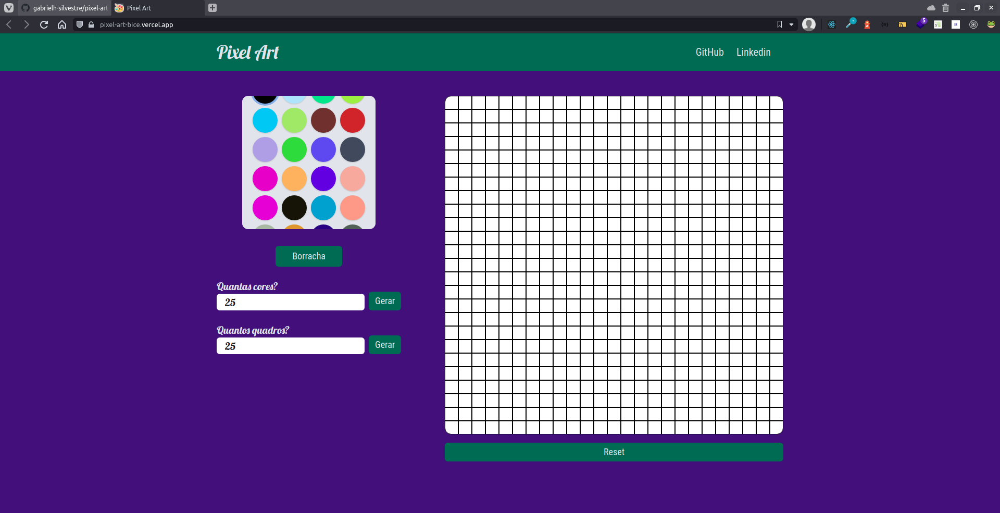

#Pixel Art

This project is a refactoring of [Trybe Pallet](https://gabrielh-silvestre.github.io/pixel_art/index.html) build to help me improve me undertandment about React.

## Table of contents

- [Overview](#overview)
  - [The challenge](#the-challenge)
  - [Screenshot](#screenshot)
  - [Links](#links)
- [My process](#my-process)
  - [Built with](#built-with)
  - [What I learned](#what-i-learned)
  - [Continued development](#continued-development)
  - [Useful resources](#useful-resources)
- [Author](#author)

## Overview

### The challenge

Users should be able to?
- Generate random colors
- Change colors quantity
- See what color is selected
- Paint with click and drag
- Change resolution (by increment or decrement canvas pixels)
- Reset canvas

### Screenshot

### Links

- Live site URL: [https://pixel-art-bice.vercel.app](https://pixel-art-bice.vercel.app)

## My process

### Built with

- React
- React contexts
- Tailwind
- Styled-Components

### What I Learned

In this project I understood the power and simplicity of the contexts in compare of Redux, I also learned the basics of Styled-Components and Tailwind Styled-Components.

### Continued development

The biggest problem in this project is the performance when the canvas exced a size of 40x40, I plan to solve this problem untill february of 2022.

### Useful resources

I just used the official docs to consult.

- [Tailwind v2.2.16](https://v2.tailwindcss.com/docs)
- [Styled Components](https://styled-components.com/docs)
- [Tailwind Styled-Component](https://www.npmjs.com/package/tailwind-styled-components)

## Author

- Linkedin - [Gabriel Silvetre](https://www.linkedin.com/in/gabrielh-silvestre/)
